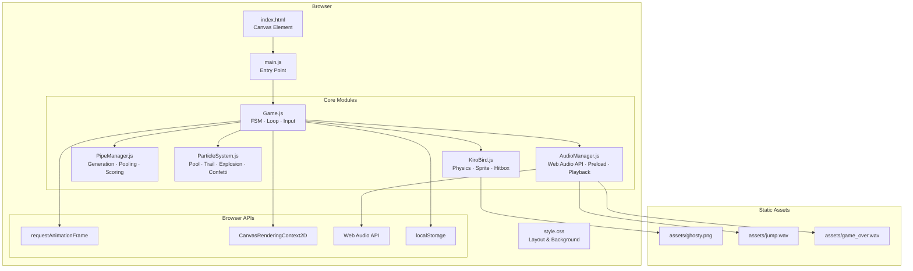
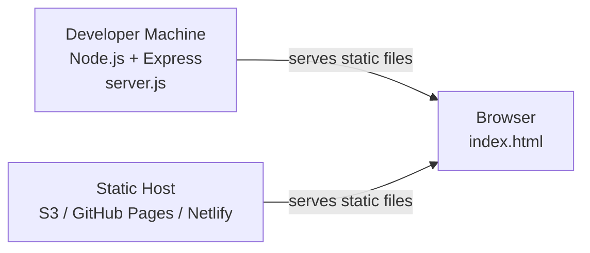
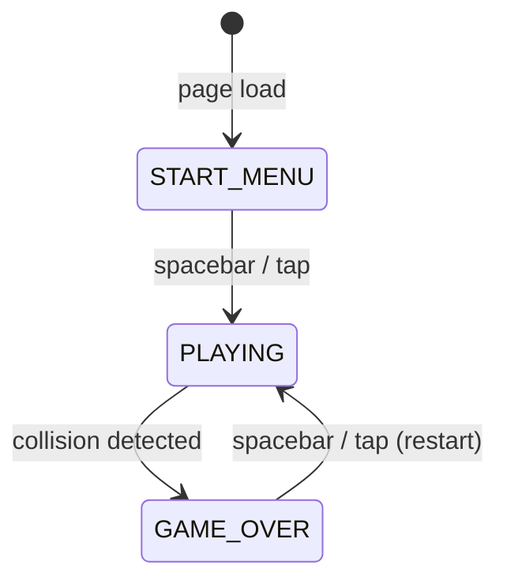
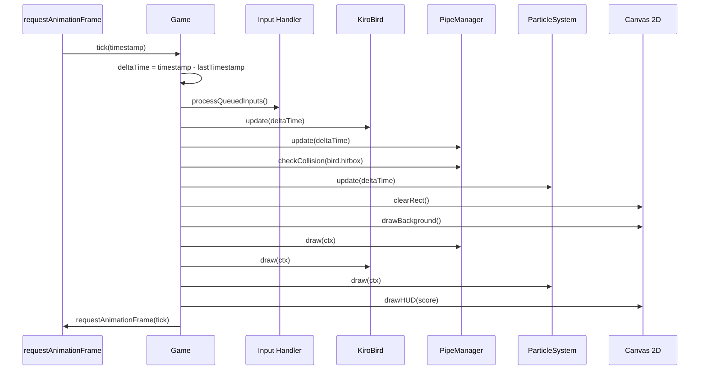
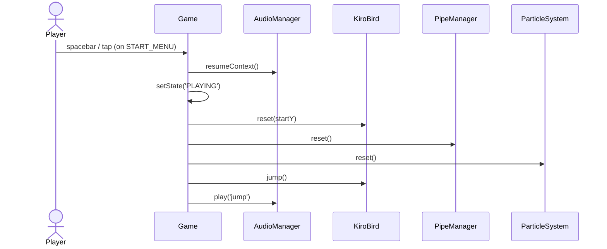
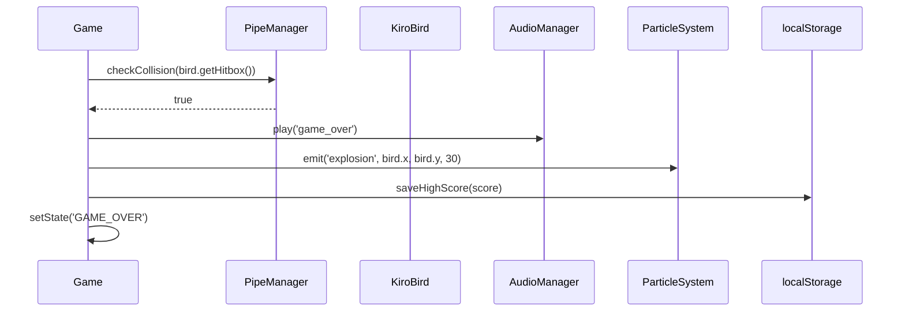
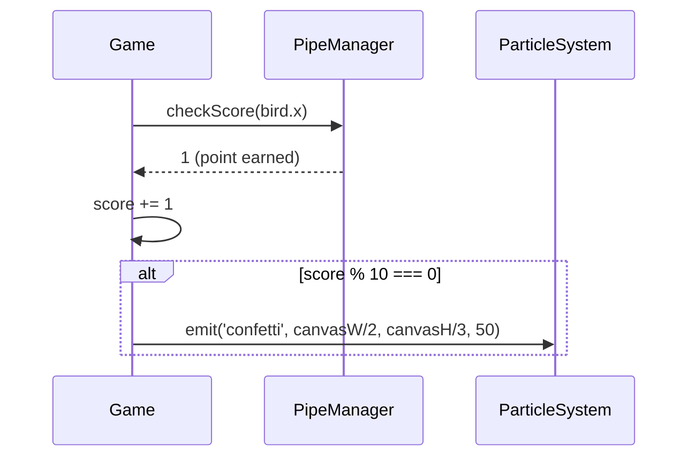

# Design Document: AWS Flappy Kiro

## Overview

AWS Flappy Kiro is a browser-based Flappy Bird–style game built with HTML5 Canvas and Vanilla JavaScript (ES6+). The player controls a character (Kiro/ghosty) that must navigate through procedurally generated pipe obstacles by tapping or pressing spacebar to apply upward jump impulses against constant gravity. The game features a finite state machine for game flow, a delta-time game loop for frame-rate independence, particle effects, Web Audio API sound, and localStorage-backed high score persistence — all delivered as a fully static site with no external JS frameworks.

---

## Architecture

### High-Level System Overview



### Deployment Model



The game is a fully static application. `server.js` is a convenience dev server only — the game runs identically when served from any static host.

---

## Finite State Machine



| State | Renders | Accepts Input |
|---|---|---|
| `START_MENU` | Title, high score, "Press Space / Tap" prompt | Space / Touch |
| `PLAYING` | Bird, pipes, particles, score HUD | Space / Touch |
| `GAME_OVER` | Final score, high score, "Restart" prompt | Space / Touch |

---

## Game Loop Architecture



---

## Components and Interfaces

### Game

**Purpose**: Top-level orchestrator. Owns the game loop, FSM, input event listeners, and coordinates all subsystems.

**Interface**:
```typescript
class Game {
  canvas: HTMLCanvasElement
  ctx: CanvasRenderingContext2D
  state: 'START_MENU' | 'PLAYING' | 'GAME_OVER'
  score: number
  highScore: number
  bird: KiroBird
  pipeManager: PipeManager
  particleSystem: ParticleSystem
  audioManager: AudioManager
  lastTimestamp: number
  inputQueue: boolean[]   // pending jump inputs

  constructor(canvas: HTMLCanvasElement): void
  start(): void                          // begins RAF loop
  tick(timestamp: number): void          // main loop callback
  setState(newState: GameState): void    // FSM transition
  handleInput(): void                    // process spacebar / touch
  reset(): void                          // reset all subsystems for new game
  loadHighScore(): number
  saveHighScore(score: number): void
  drawHUD(): void
  drawStartMenu(): void
  drawGameOver(): void
}
```

**Responsibilities**:
- Register and deregister keyboard/touch event listeners
- Drive the RAF loop with delta-time calculation
- Transition FSM states and trigger side effects (reset, save score, play audio)
- Render overlay UI (HUD, menus)

---

### KiroBird

**Purpose**: Player entity. Manages position, velocity, gravity simulation, sprite rendering, and hitbox.

**Interface**:
```typescript
class KiroBird {
  x: number
  y: number
  velocityY: number
  width: number          // sprite render width
  height: number         // sprite render height
  hitboxInset: number    // pixels inset on each side for fair collision
  sprite: HTMLImageElement
  rotation: number       // visual tilt based on velocity

  constructor(x: number, startY: number): void
  update(deltaTime: number): void   // apply gravity, clamp to bounds
  jump(): void                      // apply upward velocity impulse
  draw(ctx: CanvasRenderingContext2D): void
  getHitbox(): AABB                 // returns inset bounding box
  reset(startY: number): void
}
```

**Responsibilities**:
- Apply gravity each frame: `velocityY += GRAVITY * deltaTime`
- Apply jump impulse: `velocityY = JUMP_VELOCITY` (negative = upward)
- Rotate sprite to match velocity direction (visual polish)
- Expose `getHitbox()` for collision detection

---

### PipeManager

**Purpose**: Procedural pipe generation, scrolling, object pooling, gap randomization, and pass-through scoring.

**Interface**:
```typescript
interface Pipe {
  x: number
  topHeight: number
  gapY: number       // top of gap
  gapSize: number    // height of gap
  passed: boolean    // has bird passed this pipe?
  active: boolean    // in pool: is this pipe in use?
}

class PipeManager {
  pipes: Pipe[]           // fixed-size pool
  pipeWidth: number
  scrollSpeed: number
  spawnInterval: number   // ms between pipe spawns
  timeSinceLastSpawn: number
  canvasWidth: number
  canvasHeight: number

  constructor(canvasWidth: number, canvasHeight: number): void
  update(deltaTime: number): void        // scroll, spawn, recycle
  draw(ctx: CanvasRenderingContext2D): void
  checkCollision(hitbox: AABB): boolean  // returns true on hit
  checkScore(birdX: number): number      // returns points earned this frame
  reset(): void
  spawnPipe(): void
  recyclePipe(pipe: Pipe): void
}
```

**Responsibilities**:
- Maintain a fixed pool of `Pipe` objects; recycle off-screen pipes
- Randomize `gapY` within safe vertical bounds each spawn
- Detect when bird's leading edge crosses pipe's trailing edge → increment score
- Detect AABB overlap between bird hitbox and top/bottom pipe rectangles

---

### ParticleSystem

**Purpose**: Manages a fixed-size particle pool for three effect types: wing trail, collision explosion, confetti.

**Interface**:
```typescript
interface Particle {
  x: number
  y: number
  vx: number
  vy: number
  lifetime: number     // total lifetime in ms
  age: number          // current age in ms
  alpha: number        // computed: 1 - age/lifetime
  color: string
  size: number
  type: 'trail' | 'explosion' | 'confetti'
  active: boolean
}

class ParticleSystem {
  pool: Particle[]     // fixed size, e.g. 200
  poolSize: number

  constructor(poolSize: number): void
  update(deltaTime: number): void
  draw(ctx: CanvasRenderingContext2D): void
  emit(type: ParticleType, x: number, y: number, count: number): void
  acquireParticle(): Particle | null   // get next inactive particle from pool
  reset(): void
}
```

**Responsibilities**:
- `emit('trail', ...)` — called each frame during PLAYING state at bird's tail position
- `emit('explosion', ...)` — called once on collision
- `emit('confetti', ...)` — called on score milestone (every 10 points)
- Recycle particles when `age >= lifetime` (set `active = false`)
- Never allocate new objects during gameplay — always reuse pool slots

---

### AudioManager

**Purpose**: Preloads audio assets via Web Audio API and plays them on demand.

**Interface**:
```typescript
class AudioManager {
  context: AudioContext
  buffers: Map<string, AudioBuffer>   // keyed by sound name

  constructor(): void
  preload(sounds: Record<string, string>): Promise<void>  // name → URL map
  play(name: string): void
  resumeContext(): void   // call on first user gesture
}
```

**Responsibilities**:
- Fetch each audio file and decode via `AudioContext.decodeAudioData`
- On `play()`: create a `BufferSourceNode`, connect to `destination`, call `start()`
- Call `resumeContext()` on the first spacebar/tap to satisfy browser autoplay policy
- Silently no-op if a buffer is not found (graceful degradation)

---

## Data Models

### AABB (Axis-Aligned Bounding Box)

```typescript
interface AABB {
  x: number       // left edge
  y: number       // top edge
  width: number
  height: number
}
```

**Collision test**: Two AABBs overlap when:
- `a.x < b.x + b.width`
- `a.x + a.width > b.x`
- `a.y < b.y + b.height`
- `a.y + a.height > b.y`

### GameState

```typescript
type GameState = 'START_MENU' | 'PLAYING' | 'GAME_OVER'
```

### GameConfig (constants)

```typescript
const CONFIG = {
  CANVAS_WIDTH:      480,
  CANVAS_HEIGHT:     640,
  GRAVITY:           1800,      // px/s²
  JUMP_VELOCITY:    -520,       // px/s (negative = up)
  PIPE_SPEED:        200,       // px/s
  PIPE_WIDTH:         60,       // px
  PIPE_GAP_MIN:      130,       // px
  PIPE_GAP_MAX:      180,       // px
  PIPE_SPAWN_INTERVAL: 1800,    // ms
  PARTICLE_POOL_SIZE:  200,
  SCORE_MILESTONE:      10,     // confetti every N points
  HIGH_SCORE_KEY: 'flappyKiro_highScore'
}
```

### localStorage Schema

| Key | Type | Description |
|---|---|---|
| `flappyKiro_highScore` | `string` (numeric) | Serialized integer high score |

---

## Sequence Diagrams

### Game Start Flow



### Collision & Game Over Flow



### Score Milestone Flow



---

## Low-Level Design: Key Algorithms

### Game Loop with Delta Time

```pascal
PROCEDURE tick(timestamp)
  INPUT: timestamp — DOMHighResTimeStamp from requestAnimationFrame
  
  SEQUENCE
    deltaTime ← (timestamp - lastTimestamp) / 1000.0   // convert ms → seconds
    deltaTime ← MIN(deltaTime, 0.05)                   // cap at 50ms to prevent spiral of death
    lastTimestamp ← timestamp
    
    IF state = PLAYING THEN
      handleInput()
      bird.update(deltaTime)
      pipeManager.update(deltaTime)
      particleSystem.update(deltaTime)
      
      IF pipeManager.checkCollision(bird.getHitbox()) THEN
        onCollision()
      END IF
      
      pointsEarned ← pipeManager.checkScore(bird.x)
      score ← score + pointsEarned
      
      IF pointsEarned > 0 AND score MOD SCORE_MILESTONE = 0 THEN
        particleSystem.emit('confetti', canvas.width / 2, canvas.height / 3, 50)
      END IF
    END IF
    
    render()
    requestAnimationFrame(tick)
  END SEQUENCE
END PROCEDURE
```

**Preconditions:**
- `lastTimestamp` is initialized to the first RAF timestamp before the loop starts
- All subsystems are initialized

**Postconditions:**
- All subsystems advanced by `deltaTime` seconds
- Collision and scoring evaluated exactly once per frame
- Next RAF callback scheduled

**Loop Invariant:** `deltaTime` is always clamped to `[0, 0.05]` seconds, preventing physics instability on tab-switch or slow frames.

---

### KiroBird Physics Update

```pascal
PROCEDURE KiroBird.update(deltaTime)
  INPUT: deltaTime — seconds elapsed since last frame
  
  SEQUENCE
    // Apply gravity
    velocityY ← velocityY + (GRAVITY * deltaTime)
    
    // Integrate position
    y ← y + (velocityY * deltaTime)
    
    // Clamp to canvas bounds (ceiling and floor)
    IF y < 0 THEN
      y ← 0
      velocityY ← 0
    END IF
    
    IF y + height > CANVAS_HEIGHT THEN
      y ← CANVAS_HEIGHT - height
      // Ground collision — signal game over via return flag or exception
      velocityY ← 0
    END IF
    
    // Compute visual rotation: tilt up on ascent, tilt down on descent
    targetRotation ← CLAMP(velocityY * 0.003, -0.5, 1.2)   // radians
    rotation ← LERP(rotation, targetRotation, 10 * deltaTime)
  END SEQUENCE
END PROCEDURE
```

**Preconditions:**
- `GRAVITY > 0` (positive = downward acceleration)
- `CANVAS_HEIGHT` is the canvas pixel height

**Postconditions:**
- `y` is within `[0, CANVAS_HEIGHT - height]`
- `velocityY` reflects gravity accumulation unless clamped
- `rotation` smoothly tracks velocity direction

---

### AABB Collision Detection

```pascal
FUNCTION aabbOverlap(a, b)
  INPUT: a, b — AABB records {x, y, width, height}
  OUTPUT: boolean

  RETURN (a.x < b.x + b.width)
     AND (a.x + a.width > b.x)
     AND (a.y < b.y + b.height)
     AND (a.y + a.height > b.y)
END FUNCTION

FUNCTION PipeManager.checkCollision(birdHitbox)
  INPUT: birdHitbox — AABB
  OUTPUT: boolean

  FOR each pipe IN pipes WHERE pipe.active = true DO
    topPipeBox ← { x: pipe.x, y: 0,
                   width: pipeWidth, height: pipe.gapY }
    bottomPipeBox ← { x: pipe.x, y: pipe.gapY + pipe.gapSize,
                      width: pipeWidth,
                      height: CANVAS_HEIGHT - (pipe.gapY + pipe.gapSize) }

    IF aabbOverlap(birdHitbox, topPipeBox) THEN
      RETURN true
    END IF
    IF aabbOverlap(birdHitbox, bottomPipeBox) THEN
      RETURN true
    END IF
  END FOR

  RETURN false
END FUNCTION
```

**Preconditions:**
- `birdHitbox` is inset from the sprite bounds by `hitboxInset` pixels on each side
- `pipe.gapY + pipe.gapSize <= CANVAS_HEIGHT`

**Postconditions:**
- Returns `true` if any active pipe rectangle overlaps the bird hitbox
- Returns `false` if no collision

---

### Pipe Spawning and Recycling

```pascal
PROCEDURE PipeManager.update(deltaTime)
  INPUT: deltaTime — seconds

  SEQUENCE
    // Scroll all active pipes
    FOR each pipe IN pipes WHERE pipe.active = true DO
      pipe.x ← pipe.x - (scrollSpeed * deltaTime)
      
      // Recycle off-screen pipes
      IF pipe.x + pipeWidth < 0 THEN
        recyclePipe(pipe)
      END IF
    END FOR
    
    // Spawn new pipe on interval
    timeSinceLastSpawn ← timeSinceLastSpawn + (deltaTime * 1000)
    IF timeSinceLastSpawn >= spawnInterval THEN
      spawnPipe()
      timeSinceLastSpawn ← 0
    END IF
  END SEQUENCE
END PROCEDURE

PROCEDURE spawnPipe()
  pipe ← acquireFromPool()
  IF pipe = null THEN RETURN END IF   // pool exhausted, skip spawn
  
  gapSize ← RANDOM(PIPE_GAP_MIN, PIPE_GAP_MAX)
  gapY    ← RANDOM(60, CANVAS_HEIGHT - gapSize - 60)   // safe margins
  
  pipe.x        ← canvasWidth
  pipe.gapY     ← gapY
  pipe.gapSize  ← gapSize
  pipe.passed   ← false
  pipe.active   ← true
END PROCEDURE
```

**Loop Invariant (scroll loop):** Every active pipe's `x` decreases monotonically each frame until it exits the left edge and is recycled.

---

### Particle Pool Emission

```pascal
PROCEDURE ParticleSystem.emit(type, originX, originY, count)
  INPUT: type — 'trail' | 'explosion' | 'confetti'
         originX, originY — world position
         count — number of particles to emit

  SEQUENCE
    emitted ← 0
    FOR i FROM 0 TO poolSize - 1 DO
      IF emitted >= count THEN BREAK END IF
      IF pool[i].active = false THEN
        p ← pool[i]
        p.active   ← true
        p.age      ← 0
        p.x        ← originX
        p.y        ← originY
        p.type     ← type
        
        IF type = 'trail' THEN
          p.lifetime ← 200          // ms
          p.vx       ← RANDOM(-20, -60)
          p.vy       ← RANDOM(-20, 20)
          p.size     ← RANDOM(2, 5)
          p.color    ← 'rgba(255, 220, 100, 1)'
        ELSE IF type = 'explosion' THEN
          angle      ← RANDOM(0, 2π)
          speed      ← RANDOM(80, 250)
          p.lifetime ← RANDOM(400, 800)
          p.vx       ← COS(angle) * speed
          p.vy       ← SIN(angle) * speed
          p.size     ← RANDOM(3, 8)
          p.color    ← RANDOM_FROM(['#FF4444', '#FF8800', '#FFDD00'])
        ELSE IF type = 'confetti' THEN
          p.lifetime ← RANDOM(800, 1400)
          p.vx       ← RANDOM(-120, 120)
          p.vy       ← RANDOM(-200, -50)
          p.size     ← RANDOM(4, 9)
          p.color    ← RANDOM_FROM(['#FF6B6B','#4ECDC4','#45B7D1','#96CEB4','#FFEAA7'])
        END IF
        
        emitted ← emitted + 1
      END IF
    END FOR
  END SEQUENCE
END PROCEDURE

PROCEDURE ParticleSystem.update(deltaTime)
  FOR each p IN pool WHERE p.active = true DO
    p.age ← p.age + (deltaTime * 1000)
    p.x   ← p.x + p.vx * deltaTime
    p.y   ← p.y + p.vy * deltaTime
    p.vy  ← p.vy + 300 * deltaTime   // gravity on confetti/explosion
    p.alpha ← 1 - (p.age / p.lifetime)
    
    IF p.age >= p.lifetime THEN
      p.active ← false
    END IF
  END FOR
END PROCEDURE
```

**Preconditions:**
- Pool is pre-allocated at construction; no `new` calls during gameplay
- `count <= poolSize` (excess requests are silently capped by pool exhaustion)

**Postconditions:**
- Up to `count` inactive pool slots are activated and initialized
- All active particles have `age < lifetime`

**Loop Invariant (update):** `p.alpha` is always in `[0, 1]` because `age` increases monotonically toward `lifetime`.

---

### Audio Preloading

```pascal
PROCEDURE AudioManager.preload(sounds)
  INPUT: sounds — map of { name: string → url: string }
  OUTPUT: Promise (resolves when all buffers decoded)

  SEQUENCE
    promises ← []
    
    FOR each (name, url) IN sounds DO
      promise ← ASYNC
        response ← AWAIT fetch(url)
        arrayBuffer ← AWAIT response.arrayBuffer()
        audioBuffer ← AWAIT context.decodeAudioData(arrayBuffer)
        buffers.set(name, audioBuffer)
      END ASYNC
      promises.push(promise)
    END FOR
    
    AWAIT Promise.all(promises)
  END SEQUENCE
END PROCEDURE

PROCEDURE AudioManager.play(name)
  INPUT: name — sound key

  SEQUENCE
    buffer ← buffers.get(name)
    IF buffer = null THEN RETURN END IF   // graceful no-op
    
    source ← context.createBufferSource()
    source.buffer ← buffer
    source.connect(context.destination)
    source.start(0)
  END SEQUENCE
END PROCEDURE
```

**Preconditions:**
- `AudioContext` is created at construction
- `resumeContext()` has been called before `play()` (browser autoplay policy)

**Postconditions:**
- Each `play()` call creates an independent `BufferSourceNode` (supports overlapping sounds)
- Buffers are decoded once and reused for all subsequent plays

---

## Error Handling

### localStorage Unavailable

**Condition**: `localStorage` throws (private browsing, storage quota exceeded, or sandboxed iframe).

**Response**: Wrap all `localStorage` access in `try/catch`. On read failure, default `highScore` to `0`. On write failure, silently discard — the session score is still displayed.

```pascal
FUNCTION loadHighScore()
  TRY
    value ← localStorage.getItem('flappyKiro_highScore')
    IF value = null THEN RETURN 0 END IF
    RETURN parseInt(value, 10)
  CATCH
    RETURN 0
  END TRY
END FUNCTION
```

### AudioContext Autoplay Policy

**Condition**: Browser blocks `AudioContext` creation or playback before user gesture.

**Response**: Create `AudioContext` in a suspended state. Call `context.resume()` inside the first `keydown`/`touchstart` handler. All `play()` calls before resume are silently dropped (buffer source starts but context is suspended).

### Asset Load Failure

**Condition**: `fetch()` for an audio file fails (404, network error).

**Response**: `preload()` uses `Promise.allSettled` (or individual try/catch per fetch) so one failed asset does not block others. Missing buffers result in silent no-ops on `play()`.

### Pool Exhaustion

**Condition**: All 200 particle pool slots are active simultaneously.

**Response**: `emit()` silently emits fewer particles than requested. No crash, no allocation. The visual effect is degraded but gameplay is unaffected.

---

## Testing Strategy

### Unit Testing Approach

Test each module in isolation with a mock canvas context and mock `AudioContext`.

Key unit test cases:
- `aabbOverlap`: exhaustive boundary cases (touching edges = no overlap, 1px overlap = collision)
- `KiroBird.update`: gravity accumulation, ceiling clamp, floor clamp, jump impulse reset
- `PipeManager.checkScore`: score increments exactly once per pipe, not on subsequent frames
- `PipeManager.spawnPipe`: `gapY` always within safe vertical margins
- `ParticleSystem.emit`: pool slots activated correctly; pool exhaustion does not throw
- `AudioManager.play`: no-op when buffer missing; `BufferSourceNode` created and started when buffer present
- `loadHighScore` / `saveHighScore`: correct behavior when `localStorage` throws

### Property-Based Testing Approach

**Property Test Library**: fast-check

Properties to verify:

1. **Physics bounds**: For any sequence of `update(dt)` calls with `dt ∈ [0, 0.05]`, `bird.y` is always within `[0, CANVAS_HEIGHT - bird.height]`.

2. **Collision symmetry**: `aabbOverlap(a, b) === aabbOverlap(b, a)` for all AABB pairs.

3. **Particle pool invariant**: After any sequence of `emit()` and `update()` calls, the count of active particles never exceeds `poolSize`.

4. **Score monotonicity**: `score` never decreases during a PLAYING session.

5. **Pipe gap safety**: For any randomly generated pipe, `gapY >= 60` and `gapY + gapSize <= CANVAS_HEIGHT - 60`.

### Integration Testing Approach

- Simulate a full game session: START_MENU → PLAYING → GAME_OVER → PLAYING
- Verify FSM transitions fire correct side effects (reset called, audio triggered, score saved)
- Verify high score is updated only when session score exceeds stored value

---

## Performance Considerations

- **Delta-time cap**: `deltaTime` is clamped to 50ms max to prevent physics explosion after tab switches or slow frames.
- **Object pooling**: Both `PipeManager` and `ParticleSystem` use fixed-size pools. Zero heap allocations during active gameplay after initialization.
- **Canvas state saves**: `ctx.save()` / `ctx.restore()` used only around rotated bird draw; not called in particle or pipe loops.
- **Pipe culling**: Off-screen pipes are recycled immediately; the active pipe count stays ≤ 4 at any time given the spawn interval and canvas width.
- **Target**: Stable 60 FPS on modern desktop and mobile browsers. The entire update + render cycle should complete in < 4ms per frame.

---

## Security Considerations

- **localStorage**: Wrapped in `try/catch`; only numeric scores are written. No user-provided strings are stored or eval'd.
- **No external network requests at runtime**: All assets are bundled/served locally. No CDN dependencies during gameplay.
- **Content Security Policy**: The static site can be served with a strict CSP (`script-src 'self'`) since no inline scripts or external libraries are used.
- **Audio assets**: Loaded via `fetch` from same origin; no cross-origin audio requests.

---

## Dependencies

| Dependency | Purpose | Runtime? |
|---|---|---|
| Node.js | Dev tooling only | No |
| Express (`express`) | Local dev server (`server.js`) | No (dev only) |
| Browser: Canvas 2D API | Rendering | Yes (built-in) |
| Browser: Web Audio API | Sound playback | Yes (built-in) |
| Browser: localStorage | High score persistence | Yes (built-in) |
| Browser: requestAnimationFrame | Game loop | Yes (built-in) |

No external JavaScript libraries or game engines are required at runtime. The production artifact is `index.html` + `style.css` + `src/*.js` + `assets/`.
